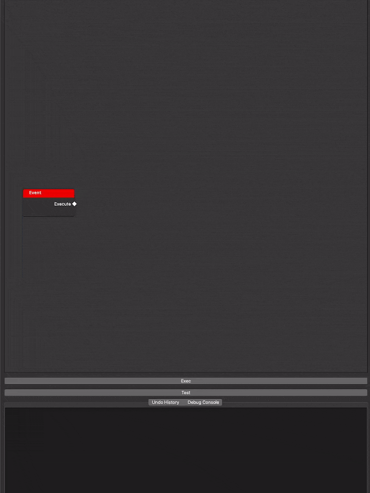

# README

A work in progress project to create a scripting framework in Python by using a nodal approach built in PySide2.

Watch [demo](#demo)

## Description

My end goal for this project is to create an API that allows the user to develop plugins for applications using PySide (Nuke, Maya, Houdini, etc.), much like the Blueprint system in Unreal Engine.

## Why

It is a mix of a case study of more complex components of PySide and the challenge of creating a visual scripting language, which is a noteworthy endeavor by itself since it has always been my dream for a long time after discovering the Blueprint system of UE.

## Install

The project uses `poetry` as the package manager:

```sh
poetry install
poetry run python -m src.main
```

## Notes

- Although the core logic is there, the project is not exactly in a working state. I am still trying to figure out most of the nodes with their execution, and there are many bugs and unfinished features.
- I want to give merit to [Pavel Křupala](https://gitlab.com/pavel.krupala) for inspiring me to start this project.

## Demo


